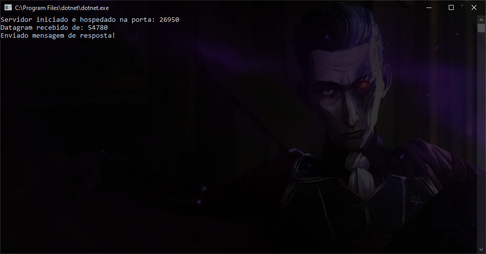
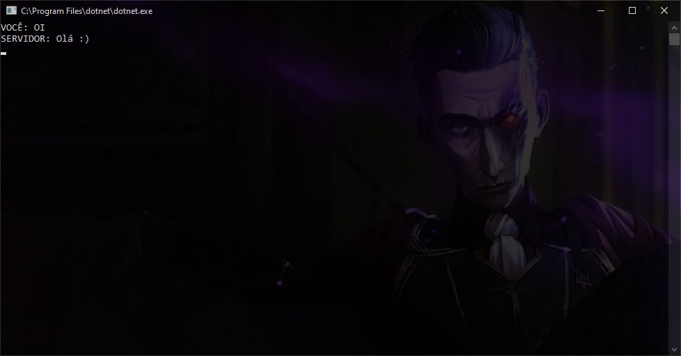

# ServerUDP
ServerUDP é um servidor criado em .NET Core com C#, é um projeto simples e de fácil entendimento, os dados são armazenado em uma Class chamado datagram que contém as variáveis que serão enviado para o client, essa class é convertido para XML e do XML é convertido para bytes[], é perfeito para criação de servidores de jogos como por exemplo a Unity 3D.

 
 

### Como utilizar
Baixe os dois projetos ([ServerUDP](https://github.com/treviasxk/ServerUDP) e [ClientUDP](https://github.com/treviasxk/ClientUDP)) e apenas compile que já funcionará como demonstração, entre a comunicação do Server para o Client.

### Documentação

| Ações | Descrição |
|-----------|---------------|
| StartServer(String, Int, Class) | (ServerUDP) Insira um IP, Porta e uma class, para poder iniciar o servidor.|
| ConnectServer(String, Int, Class) | (ClientUDP) Insira um IP, Porta e uma class, para conectar com o servidor.|
| SendData(object, IPEndPoint) | (ServerUDP) Depois de formar o datagram você pode enviar os dados para um client com o IPEndPoint dele.|
| SendData(object) | (ClientUDP) Depois de formar o datagram os dados serão enviado para o servidor conectado.|

| Variáveis | Descrição|
|------|-----|
| Classes | dtg é uma class que contém variáveis que você deseja enviar. O ServerUDP e ClientUDP tem que ter os mesmo valores da class para o envio funcionar perfeitamente.|

| Eventos | Descrição|
|------|-----|
| OnReceivedNewDataServer(datagram) | (ClientUDP) Aqui você receberá o datagram do servidor.|
| OnReceivedNewDataClient(datagram, IPEndPoint) | (ServerUDP) Aqui você receberá o datagram e IPEndPoint do client que enviou o datagram.|
| ChangeStatusServer(StatusServer) | Sempre que o servidor for ligado ou desligado.|
